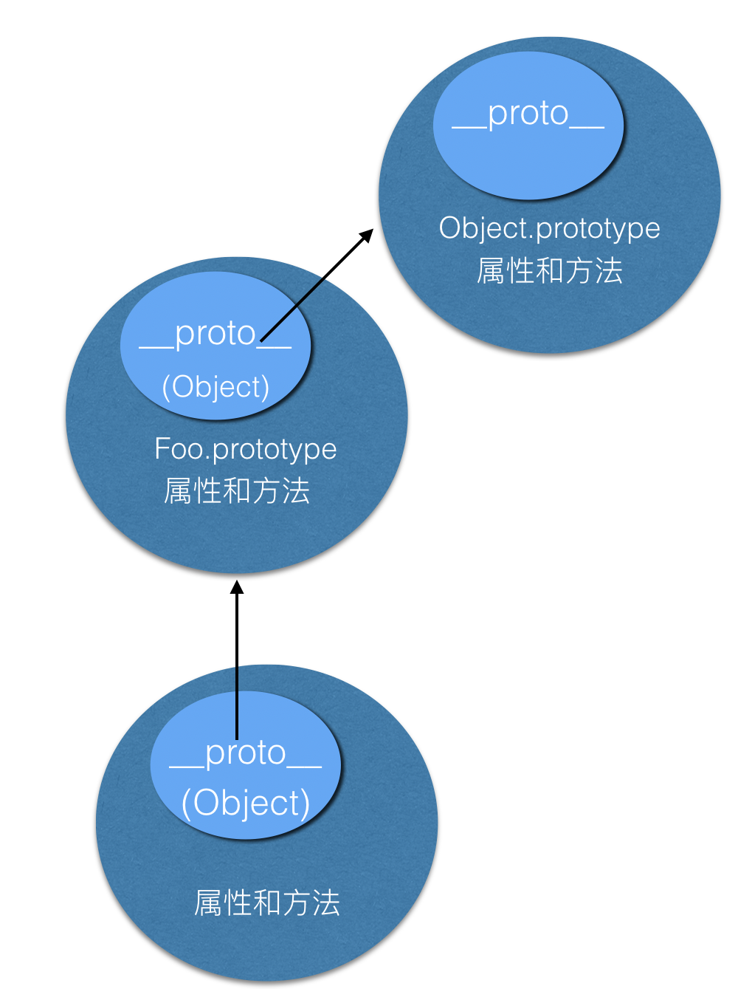

[TOC]


## 1、ECMAScript 6基础

**ECMAScript 6 简介**

- JavaScript 三大组成部分

    - ECMAScript
    - DOM
    - BOM

- ECMAScript 发展历史 https://developer.mozilla.org/zh-CN/docs/Web/JavaScript/Language_Resources
- ECMAScript 包含内容：JS 中的数据类型及相关操作，流程控制，运算符及相关运算......

**ECMAScript 6**


### let 和 const

- let 和 var 的差异

    - let 允许声明一个在作用域限制在块级中的变量、语句或者表达式
      - 块级作用域
    - var 声明的变量只能是全局或者整个函数块的
    - let 不能重复声明
    
    - let 不会被预解析
    - 手册地址：https://developer.mozilla.org/zh-CN/docs/Web/JavaScript/Reference/Statements/let
    
- const 常量

    - 常量不能重新赋值
    
    - 不能重复声明
    
    - 块级作用域
    
    - const 不会被预解析
    
    - 手册地址：https://developer.mozilla.org/zh-CN/docs/Web/JavaScript/Reference/Statements/const
    
      
    
      
    
      
    
      
    


###     解构赋值

- 对象的解构赋值

- 数组的解构赋值

- 字符串的解构赋值

- 手册地址：https://developer.mozilla.org/zh-CN/docs/Web/JavaScript/Reference/Operators/Destructuring_assignment
        
  
  
  
  


### 展开运算符

- 对象展开

- 数组展开

- 手册地址：https://developer.mozilla.org/zh-CN/docs/Web/JavaScript/Reference/Operators/Spread_syntax


### Set 对象

- Set 对象的数据结构

- Set 相关属性和方法

    - size 属性
    - clear()、delete()、get()、has()、add()
    
- 手册地址：https://developer.mozilla.org/zh-CN/docs/Web/JavaScript/Reference/Global_Objects/Set


### Map 对象

- Map 对象的数据结构

- Map 相关属性与方法

- size 属性

- clear()、delete()、get()、has()、set()

- 手册地址：https://developer.mozilla.org/zh-CN/docs/Web/JavaScript/Reference/Global_Objects/Map


### 函数新增扩展

- 箭头函数

    - 箭头函数的各种写法
    
    - 箭头函数的this问题
    
    - 箭头函数的不定参问题
    
    - 手册地址：https://developer.mozilla.org/zh-CN/docs/Web/JavaScript/Reference/Functions/Arrow_functions
    
- rest 参数设置
- 参数默认值


### 新增数组扩展

- Array.from()、Array.of()

- find()、findIndex()、includes()
- flat()、flatMap()
- 手册地址：https://developer.mozilla.org/zh-CN/docs/Web/JavaScript/Reference/Global_Objects/Array


### 新增字符串扩展

- includes(), startsWith(), endsWith()
  
- repeat()
- 模板字符串
- 手册地址：https://developer.mozilla.org/zh-CN/docs/Web/JavaScript/Reference/Global_Objects/String


### 新增对象扩展

- 属性简洁表示法

- 属性名表达式
- 手册地址：https://developer.mozilla.org/zh-CN/docs/Web/JavaScript/Reference/Global_Objects/Object


### babel 使用

- Babel 是一个 JavaScript 编译器

- 手册地址：https://www.babeljs.cn/
- Babel 基本是否方法


### 案例一：员工列表


 [员工列表](案例\案例1（员工列表）\index.html) 


### 案例二：百度音乐全选


 [百度音乐榜单](案例\案例2（百度音乐榜单）\index.html) 


## 2、面向对象

### 工厂模式

```js
//    工厂模式
function Tab(){
    //添加原料
    let obj = {};
    //加工原料
    obj.tablength = 1;
    obj.psFor = function(){
        console.log("psFor....");
    }
    //出厂
    return obj;
}

// function Page(){
//     return {
//         pagecount:1
//     };
// }
// 缺点一：
// 对象识别问题；

// let page = Page();

// console.log(tab1.constructor);

// tab1.psFor();
let tab1 = Tab();
let tab2 = Tab();
// tab2.psFor();
// 缺点二：性能问题；
// let str = new String();  //判断类型
// let obj = new Object();
// console.log(tab1.psFor===tab2.psFor);
// 公共空间：原型 prototype； ---》  new 运算符；
```

工厂模式解决了代码复用的问题，

1.但是却没有解决对象识别的问题。即创建的所有实例都是Object类型。(不清楚是哪个对象的实例)

2.没有原型，占用内存。

- 更好的方式？

##new运算符

- new的特点：1.new只能函数 2.自动创建空对象； 3.this绑定到空对象；4 隐式返还this；
- 通过new来改造工厂模式

##构造函数

- 构造函数要通过new来调用 this指向Student
- 约定俗成构造函数首字母大写

##构造函数性能对比工厂函数

- 公共空间存放公共方法

##构造函数原型


### new 运算符

new运算符：1.执行函数；

​                       2.自动创建一个空对象； 

​                       3.把创建的对象指向另外一个对象；

​                       4.把空对象和函数里的this 衔接起来；(this指向实例化对象)

​                       5.隐式返还this；

```js
function test() {
    console.log("test..");
}
test(); // test..
new test(); // test..
//简化工厂模式；---->构造函数；
// 1.约定俗成：首字符大写；
// 2.属性放在构造函数；方法放在原型；
// let Tab = {}
function Tab() {
    // let obj = {};--->this;
    this.name = "张三";
    // this.hobby = function(){
    //     console.log("篮球");
    // }
    // return obj;
}
Tab.prototype.psFor = function () {
    console.log("psFor...");
};
Tab.prototype.hobby = function () {
    console.log("hobby...", this.name);
};
//每个原型上都有一个预定义属性； constructor---》构造函数；
// 覆盖原本 constructor属性；
Tab.prototype = {
    constructor: Tab,
    psFor() {
        console.log("psFor...");
    },
    hobby() {
        console.log("hobby...", this.name); // hobby... 张三
    },
};

let str = "1212fdsf";
// let str = new String("fdsfdsa");
if (str.constructor === String) {
    console.log("字符串");
} else {
    console.log("不是");
} // 字符串

Tab();
let tab1 = new Tab();
console.log(tab1.constructor === Tab); // true

console.log(tab1.__proto__ === Tab.prototype); // true
console.log(tab1.name); // 张三
tab1.hobby();
let tab2 = new Tab("张三", "lisi");
console.log(tab1.psFor === tab2.psFor); // true
tab2.hobby();
```

**仿写new 运算符**

```js
function myNew(constructor, ...arg) {
    let obj = {};
    constructor.call(obj, ...arg);
    obj.__proto__ = constructor.prototype;
    return obj;
}

let tab1 = myNew(Tab);
console.log(tab1.name) // 张三
tab1.psFor();
```


### prototype原型

- 通过new实例化出来的对象其属性和行为来自两个部分，一部分来自构造函数，另一部分来自原型。
- 当声明一个函数的时候，同时也申明了一个原型 。
- 原型本身是一个对象。
- 对象属性方法查找规则；


### 面向对象编程

 一、面相过程：注重解决问题的步骤，分析问题需要的每一步，实现函数依次调用；

 二、面相对象：面向对象编程是用抽象方式创建基于现实世界模型的一种编程模式；

三、面相对象特性： 抽象、 继承、封装、多态


### 对象和类

​	一、对象：具体的某个事物；(如：小明、叮当猫)

​	二、类：一类事物的抽象；(如：人类、猫类)


### 构造函数继承

- 继承：子类继承父类所有属性和行为，父类不受影响。
- 目的：找到类之间的共性精简代码

```js
function Person(name){
    this.name = name;
    this.eyes = "两只";
    this.legs = "两条";
}
function Student(name){
    Person.call(this,name)
    this.className = "二班";
}
let newPerson = new Student("张三");
console.log(newPerson.className);
```


- 简单原型继承,出现影响父类的情况；

  ```js
  function Person(name){
      this.name = name;
      this.eyes = "两只";
      this.legs = "两条";
  }
  function Student(name){
      Person.call(this,name)
      this.className = "二班";
  }
  Student.prototype = Person.prototype  //直接赋值
  ```


### 原型链

原型链是指对象在访问属性或方法时的查找方式。

1.当访问一个对象的属性或方法时，会先在对象自身上查找属性或方法是否存在，如果存在就使用对象自身的属性或方法。如果不存在就去创建对象的构造函数的原型对象中查找 ，依此类推，直到找到为止。如果到顶层对象中还找不到，则返回 undefined。

2.原型链最顶层为 Object 构造函数的 prototype 原型对象，给 Object.prototype 添加属性或方法可以被除  null 和 undefined 之外的所有数据类型对象使用。




### 原型的深拷贝继承

- 传值和传址问题

  - 基本数据类型：Number、String、Boolean、Null、Undefined
  - 复杂数据类型/引用数据类型:Array、Date、Math、RegExp、Object、Function等

- JOSN序列化的不足

  ```js
  //如果拷贝对象包含函数，或者undefined等值，此方法就会出现问题
  let obj = {
      name: "张三",
      age: 20,
      arr: [1, 2, 3],
      obj3: {},
      test: undefined,
      fn: function () {
          console.log("fn...");
      },
      test2: null,
  };
  let obj2 = JSON.parse(JSON.stringify(obj));
  console.log(obj); // {name: "张三", age: 20, arr: Array(3),fn: ƒ (), obj3: {}, test: undefined,test2:null}
  console.log(obj2); // {name: "张三", age: 20, arr: Array(3), obj3: {}, test2: null}
  ```

- 浅拷贝和深拷贝

  ```js
  //递归深拷贝
  function deepCopy(obj){
      let newObj = Array.isArray(obj)?[]:{};
      for(let key in obj){
          if(obj.hasOwnProperty(key)){
              if(typeof obj[key] == "object"){
                  newObj[key] = deepCopy(obj[key]);
              }else{
                  newObj[key] = obj[key];
              }
          }
      }
      return newObj;
  }
  ```

  

###原型的继承

- 深拷贝继承

  ```js
  function Dad() {
      this.name = "张三";
  }
  Dad.prototype.hobby = function () {
      console.log("喜欢篮球");
  };
  function Son() {
      Dad.call(this);
  }
  Son.prototype = deepCopy(Dad.prototype);
  Son.prototype.constructor = Son;
  
  let newSon = new Son();
  newSon.hobby(); // 喜欢篮球
  ```

  

- 组合继承

  ```js
  function Dad(){
      this.name = "张三";
  }
  Dad.prototype.hobby = function(){
      console.log("喜欢篮球");
  }
  function Son(){
      Dad.call(this);
  }
  let F = function(){}
  F.prototype = Dad.prototype;
  Son.prototype = new F();
  Son.prototype.constructor = Son;
  
  let newSon = new Son();
  newSon.hobby();
  ```


### ES6中的类

- 类的写法

```js
class Person{
  	height="178cm";
    constructor(name,age){
        //属性
        this.name = name;
        this.age = age;
    }
    //方法
    getName(){
        console.log("姓名是:"+this.name);
    }
}
let student = new Person("张三",20);
student.getName(); 
```

- 静态方法和属性:实例不会继承的属性和方法

  ```js
  class Person{
      //静态方法
      static hobby(){
          console.log("喜欢篮球");
      }
  }
  //静态属性
  Person.height = "178cm";
  //通过类来调用
  Person.hobby();
  console.log(Person.height);
  ```

  

- 类的继承:extends

  ```js
  class Dad{
      name = "张三";
      age = 40;
      constructor(height){
          this.height = height;
      }
      hobby(){
          console.log("喜欢篮球");
      }
      setStyle(){
          console.log("父类逻辑");
      }
  }
  class Son extends Dad{
      constructor(height){
          //表示父类的构造函数
          super(height);
      }
      setStyle(){
          super.setStyle();
          console.log("子类逻辑");
      }
  }
  let son1 = new Son("178cm");
  son1.setStyle(); // 父类逻辑 子类逻辑
  console.log(son1.height); // 178cm
  ```

  

### 包装对象

- 除过null,undefined，基本类型都有自己对应的包装对象：String Number Boolean 	

- 包装对象把所有的属性和方法给了基本类型，然后包装对象消失

  ```js
  // let str = new String("a b c");
  // console.log(str); // String {"a b c"}
  // let arr = str.split(" ");
  // console.log(arr); //  ["a", "b", "c"]
  
  let str = "a b c";
  function mysplit(str, method, arg) {
      let temp = new String(str);
      return temp[method](arg);
      //销毁包装对象；
  }
  let arr = mysplit(str, "split", " ");
  console.log(arr); //  ["a", "b", "c"]
  ```

  

### 常用方法

- hasOwnProperty()：看是不是对象自身底下的属性

- contructor查看对象的构造函数 可以用来做判断

- instanceof:对象与构造函数是否在原型链上有关系

- toString()判断类型；  转换字符串  进制转换

  ```js
  function Person() {
      this.name = "张三";
  }
  
  // constructor
  // Person.prototype.constructor;
  let zhangsan = new Person();
  console.log(zhangsan.constructor === Person); // true
  let arr = [1, 2, 3];
  console.log(arr.constructor === Array); // true
  
  // // instanceof
  let arr = [];
  console.log(arr instanceof Array); // true
  console.log(arr instanceof Object); // true
  
  // typeof
  let arr = [];
  let obj = {};
  console.log(typeof arr); // object
  console.log(typeof obj); // object
  
  // toString
  let res = Object.prototype.toString.call(arr);
  let res2 = Object.prototype.toString.call(obj);
  console.log(res); // [object Array]
  console.log(res2); // [object Object]
  console.log(res === "[object Array]"); // true
  ```


### 自定义组件弹框

- **组件是什么？**

  ​	 组件 ：数据和方法的简单封装；

  **弹窗功能**

  - 属性：宽、高、标题、内容；

  - 方法：打开 、关闭、渲染、拖拽

  - 配置

    ```js
    {
    	width: "30%",
    	height: "250px",
    	title: "测试标题",
    	content: "测试内容",
    	dragable: true, //是否可拖拽
    	maskable: true, //是否有遮罩
    	isCancel:false //是否有取消
    }
    ```


  **合并配置**

  - 解构赋值添加默认参数
  - 通过Object.assagin来合并

  ###渲染视图

  - 创建dom解构；es6表达式做判断；
  - 初始化
  - 打开方法
  - 关闭方法
  - 拖拽方法

  **事件委托**

  - 节点不存在绑定事件，委托给父级添加事件

  ```js
  this.dailogHtml.onclick = e => {
      //console.log(e.target.className);
      switch (e.target.className) {
          case 'k-close':
              this.close();
              // this.opts.cancel();
              // this.trigger("cancel");
              this.dispatchEvent(cancel);
              break;
          case 'k-cancel':
              this.close();
              // this.opts.cancel();
              // this.trigger("cancel");
              this.dispatchEvent(cancel);
              break;
          case 'k-primary':
              this.close();
              // this.opts.success();
              // this.trigger("success");
              this.confim();
              break;
      }
  }
  ```

  **自定义事件**

  - 自定义事件绑定addEvent
  - 自定义事件触发trigger

  ```js
  function fn1() {
      console.log("很多逻辑a");
  }
  function fn2() {
      console.log("很多逻辑b");
  }
  // fn1();
  // fn2();
  // document.querySelector(".btn").addEventListener("click", fn1);
  // document.querySelector(".btn").addEventListener("click", fn2);
  
  // let handle = {
  //     // "myevent1"
  //     // "myevent2":[fn1,fn2,fn3....],
  //     // "myevent3":[fn1,fn2,fn3....],
  // };
  
  class MyEvent {
      constructor() {
          this.handle = {};
      }
      addEvent(eventName, fn) {
          if (typeof this.handle[eventName] === "undefined") {
              this.handle[eventName] = [];
          }
          this.handle[eventName].push(fn);
      }
      trigger(eventName) {
          if (!(eventName in this.handle)) {
              return;
          }
          this.handle[eventName].forEach((v) => {
              v();
          });
      }
      removeEvent(eventName, fn) {
          if (!(eventName in this.handle)) {
              return;
          }
          for (let i = 0; i < this.handle[eventName].length; i++) {
              if (this.handle[eventName][i] === fn) {
                  this.handle[eventName].splice(i, 1);
                  break;
              }
          }
      }
  }
  let newEvent = new MyEvent();
  newEvent.addEvent("myEvent", fn1);
  newEvent.addEvent("myEvent", fn2);
  // newEvent.removeEvent("myEvent", fn2);
  newEvent.trigger("myEvent"); // 很多逻辑a 很多逻辑b
  ```

  **继承扩展功能**

  - 遮罩层、取消按钮、
  - 重写和功能相关的方法；

### 面向对象应用之实现jQ库核心功能

（1）定义函数返还JQ对象 

（2）ready方法和原生节点处理

（3）选择器封装 

（4）封装JQ的eq方法

 （5）封装JQ的click方法 

（6）jQ中的链式操作

```js
$("div").eq(0).click(function(){
    console.log(1111);
})
let res = $("div").eq(0).end();

$(".box1").on("mouseover   mousedown  ",function(){
    console.log("333");
})
```

（7）封装JQ的css方法 

```js
let res = $("div").css("background");
console.log(res)

$("div").css("width",200);
$.cssNumber['wh'] = true;

$("div").css("opacity",0.5);
$("div").css({"width":"200px","height":"200px"});
```

（8）cssHooks扩展功能

```js
$.cssHooks['wh'] = {
    get(ele){
        console.log(ele);
        return ele.offsetWidth + " " + ele.offsetHeight;
    },
    set(ele,value){
        ele.style.width = value;
        ele.style.height = value;
    }
}
let res = $("div").css("wh");
console.log(res); // 100 100

$("div").css("wh","200px");
```

js代码：

```js
class Jq {
    constructor(arg, root) {
        if (typeof root === 'undefined') {
            this['prevObject'] = [document];
        } else {
            this['prevObject'] = root;
        }
        if (typeof arg === "function") {
            //dom结构加载完毕执行代码
            this.ready(arg);
        } else if (typeof arg === "string") {
            // .box1
            let ele = document.querySelectorAll(arg);
            this.addELement(ele);
        } else {
            //传入js原生节点；
            if (typeof arg.length === 'undefined') {
                // 一个对象节点；
                this[0] = arg;
                this.length = 1;
            } else {
                // 多个对象节点
                this.addELement(arg);
            }
        }
    }
    eq(index) {
        return new Jq(this[index], this);
    }
    get(index) {
        return this[index];
    }
    end() {
        return this['prevObject'];
    }
    addELement(ele) {
        // ["张三" , "李四" ,"王五" ]  0,1,2
        ele.forEach((el, index) => {
            this[index] = el;
        })
        this.length = ele.length;
    }
    ready(arg) {
        window.addEventListener("DOMContentLoaded", arg, false);
    }

    click(fn) {
        // fn();
        for (let i = 0; i < this.length; i++) {
            this[i].addEventListener("click", fn, false);
        }
    }
    on(eventName, fn) {
        let reg = /\s+/g;
        eventName = eventName.replace(reg, " ");
        let arr = eventName.split(" ");
        for (let i = 0; i < this.length; i++) {
            for (let j = 0; j < arr.length; j++) {
                this[i].addEventListener(arr[j], fn, false);
            }
        }
    }
    css(...arg){
        if(arg.length===1){
            if(typeof arg[0] === 'string'){
                if(arg[0] in $.cssHooks){
                     return  $.cssHooks[arg[0]].get(this[0]);
                }
                //字符串；获取样式
              return this.getStyle(this[0],arg[0]);
            }else{
                //传入的是对象；
                for(let i=0;i<this.length;i++){
                    for(let j in arg[0]){
                        this.setStyle(this[i],j,arg[0][j]);
                    }
                }
            }
        }else{
            //多个参数
            for(let i=0;i<this.length;i++){
                this.setStyle(this[i],arg[0],arg[1]);
            }
        }
        return this;
    }
    setStyle(ele,styleName,styleValue){
        if(typeof styleValue === 'number' && !(styleName in $.cssNumber)){
            styleValue = styleValue + "px";
        }
        if(styleName in $.cssHooks){
            $.cssHooks[styleName].set(ele,styleValue);
        }else{
            ele.style[styleName] = styleValue;
        }
    }
    getStyle(ele,styleName){
      return  window.getComputedStyle(ele,null)[styleName];
    }
}

function $(arg) {
    return new Jq(arg);
}

$.cssNumber = {
    animationIterationCount: true,
    columnCount: true,
    fillOpacity: true,
    flexGrow: true,
    flexShrink: true,
    fontWeight: true,
    gridArea: true,
    gridColumn: true,
    gridColumnEnd: true,
    gridColumnStart: true,
    gridRow: true,
    gridRowEnd: true,
    gridRowStart: true,
    lineHeight: true,
    opacity: true,
    order: true,
    orphans: true,
    widows: true,
    zIndex: true,
    zoom: true
}
$.cssHooks = {};
```


### 案例一：多个选项卡


 [多个选项卡](案例\案例3（多个选项卡）\1-多个选项卡改造构造 函数.html) 

### 案例二：拖拽限定范围


 [拖拽限定范围](https://github.com/webmtt/summary/blob/main/Web%E9%AB%98%E7%BA%A7%E8%AF%BE%E7%A8%8B-%E5%93%94%E5%93%A9%E5%93%94%E5%93%A9/%E6%A1%88%E4%BE%8B/%E6%A1%88%E4%BE%8B4%20%EF%BC%88%E6%8B%96%E6%8B%BD%E9%99%90%E5%AE%9A%E8%8C%83%E5%9B%B4%EF%BC%89/1%E3%80%81%E6%8B%96%E6%8B%BD%E9%99%90%E5%AE%9A%E8%8C%83%E5%9B%B4%E7%BB%A7%E6%89%BF%E6%89%A9%E5%B1%95%E6%B7%B1%E6%8B%B7%E8%B4%9D.html) 

### 案例三：自定义组件弹框


 [自定义组件弹框](案例\案例5 （自定义组件弹框）\1-组件样式模板.html) 

